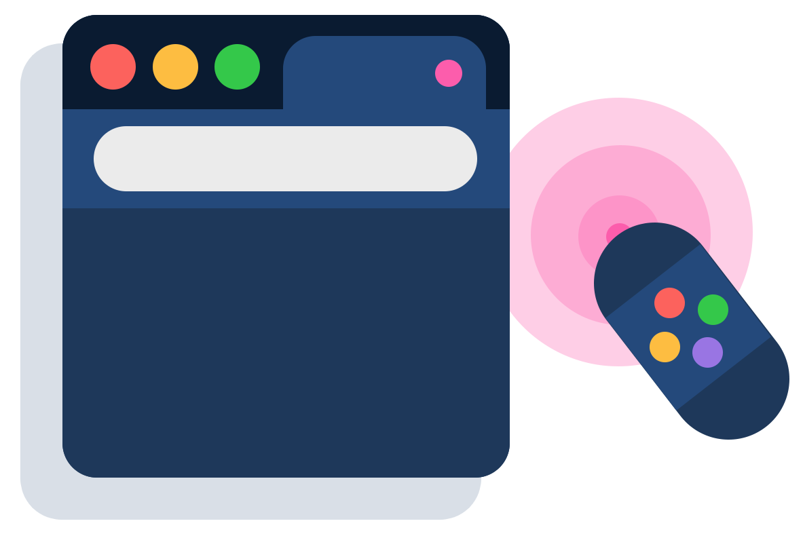
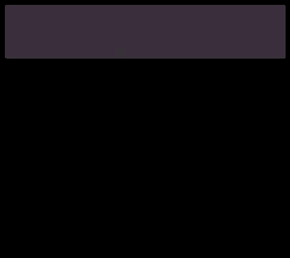
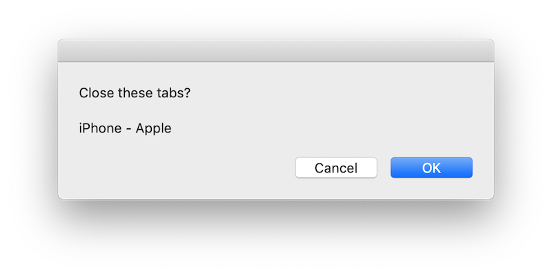

Chrome Control
==============



A JXA script and an Alfred Workflow for controlling Google Chrome
(Javascript for Automation). Also see my [How I Navigate Hundreds of Tabs on Chrome with JXA and Alfred](https://medium.com/@bit2pixel/how-i-navigate-hundreds-of-tabs-on-chrome-with-jxa-and-alfred-9bbf971af02b) article if you're interested in learning how I created the workflow.

Usage
-----

Make this file an executable
```sh
chmod +x ./chrome.js
```

Then run: 
```sh
./chrome.js
```


> MacOS will ask you to allow permissions for this tool to control Chrome.  
> Feel free to inspect the code before accepting.

Integration
-----------

You can use `chrome-control` to create fun integrations with your favorite tools (Alfred, vim, vscode, iterm2, ...).

### Alfred

I've created an Alfred Workflow to use Chrome Control.
You can find it under the intergrations directory.

Alfred for Chrome Control:
  - `tabs`: Lists all tabs
  - `close url <keywords>`: Close tabs with URLs matching these keywords
  - `close title <keywords>`: Close tabs with titles matching these keywords
  - `dedup`: Close duplicate tabs




Commands
--------

### Close duplicate tabs

```sh
./chrome.js dedup
```


### Close all tabs by `titles` containing strings 
> Strings are separated by spaces and `case insensitive`.

```sh
./chrome.js close --title "inbox" "iphone - apple"
```

```sh
./chrome.js close --title inbox iphone
```

### Close all tabs by `URLs` containing strings
> Strings are separated by spaces and `case insensitive`.

```sh
./chrome.js close --url "mail.google" "apple"
```

```sh
./chrome.js close --url google apple
```

### List all open tabs in all Chrome windows

```sh
./chrome.js list
```

The output is `JSON`, so you can pipe it to `jq`.
```sh
./chrome.js list | jq .
```

Returns a struct like this:

```json
{
  "items": [
    {
      "title": "Inbox (1) - <hidden>@gmail.com - Gmail",
      "url": "https://mail.google.com/mail/u/0/#inbox",
      "winIdx": 0,
      "tabIdx": 0,
      "arg": "0,0",
      "subtitle": "https://mail.google.com/mail/u/0/#inbox"
    },
    {
      "title": "iPhone - Apple",
      "url": "https://www.apple.com/iphone/",
      "winIdx": 0,
      "tabIdx": 1,
      "arg": "0,1",
      "subtitle": "https://www.apple.com/iphone/"
    }
  ]
}
```

> `arg` and `subtitle` are used for [Alfred](https://www.alfredapp.com/) integration.

### Close a specific tab in a specific window

> `Window Index` and `Tab Index` is the `arg` returned by the `list` command.

```js
./chrome.js close 0,13
```


### Focus on a specific tab in a specific window

```js
./chrome.js focus 0,13
```

### Show help

```sh
./chrome.js 
```

### Don't prompt the user

`--yes` flag will cause no questions to be asked to the user. It'll close all tabs straight away.

> Attention: Use this with caution. Make sure you don't have any unsaved work, emails, ... etc.

### Prompt user in Chrome

`--ui` flag will cause the questions to be asked using a Chrome dialog instead of text in command line.

```sh
./chrome.js close --url apple --ui
```



## How did you create the banner and icon?

It took around 4 hours using Photoshop. I wanted to use Illustrator but I realized that I completely forgot how to use it.

Drawing the shapes are pretty easy but I spent most of the time on the following:
- Picking harmonious colors.
- Figuring out how to make it less dull, ended up using a shadow under the window which made a significant difference.
- Figuring out how to represent the infrared waves.
- Finding a way to export the PNG to ICNS.

Planning to write an article on that soon.

## License

Copyright (c) 2019 Renan Cakirerk

Permission is hereby granted, free of charge, to any person obtaining a copy
of this software and associated documentation files (the "Software"), to deal
in the Software without restriction, including without limitation the rights
to use, copy, modify, merge, publish, distribute, sublicense, and/or sell
copies of the Software, and to permit persons to whom the Software is
furnished to do so, subject to the following conditions:

The above copyright notice and this permission notice shall be included in all
copies or substantial portions of the Software.

THE SOFTWARE IS PROVIDED "AS IS", WITHOUT WARRANTY OF ANY KIND, EXPRESS OR
IMPLIED, INCLUDING BUT NOT LIMITED TO THE WARRANTIES OF MERCHANTABILITY,
FITNESS FOR A PARTICULAR PURPOSE AND NONINFRINGEMENT. IN NO EVENT SHALL THE
AUTHORS OR COPYRIGHT HOLDERS BE LIABLE FOR ANY CLAIM, DAMAGES OR OTHER
LIABILITY, WHETHER IN AN ACTION OF CONTRACT, TORT OR OTHERWISE, ARISING FROM,
OUT OF OR IN CONNECTION WITH THE SOFTWARE OR THE USE OR OTHER DEALINGS IN THE
SOFTWARE.

